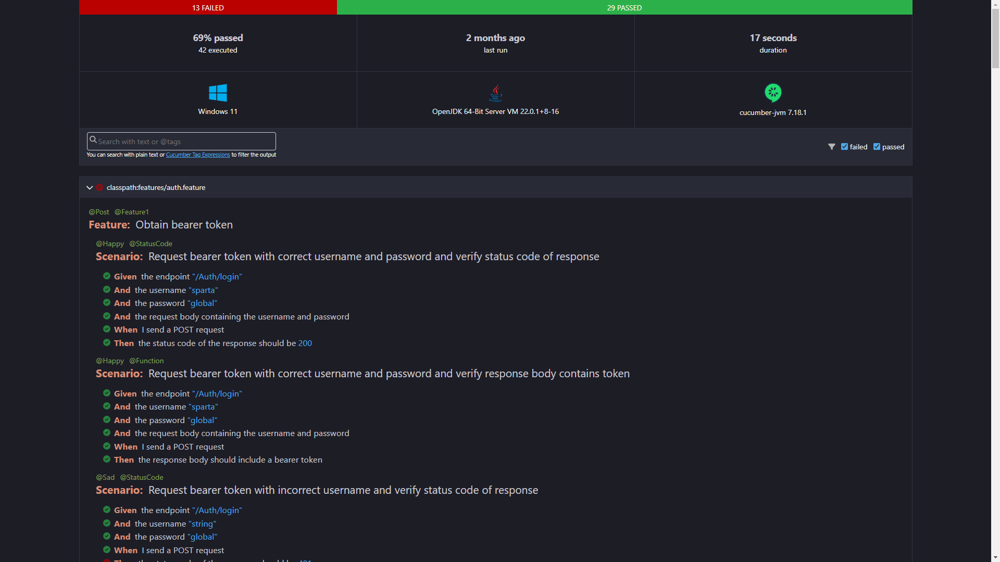
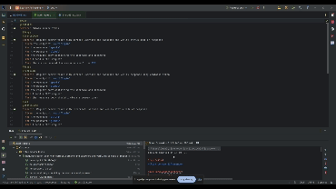
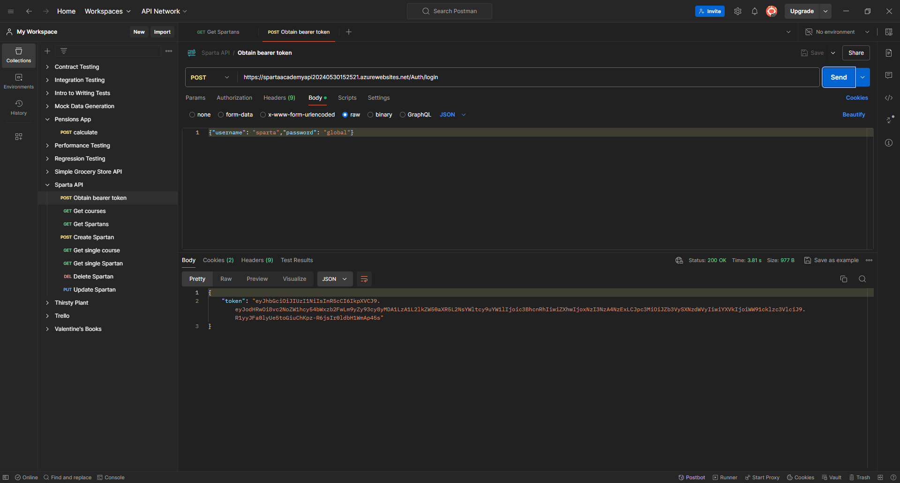
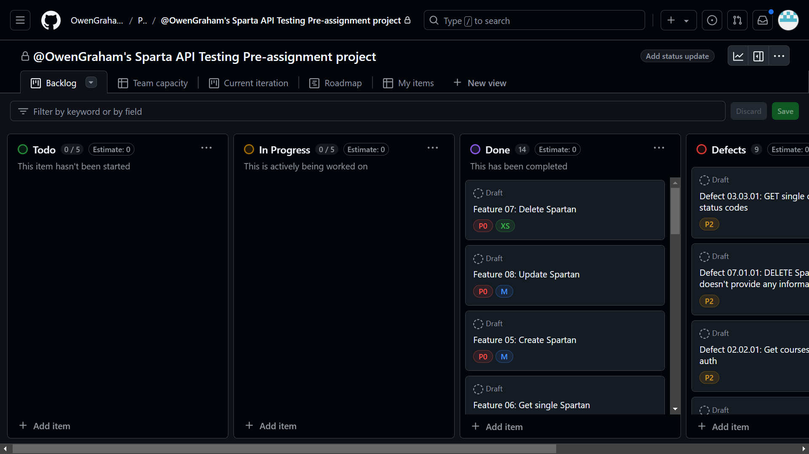
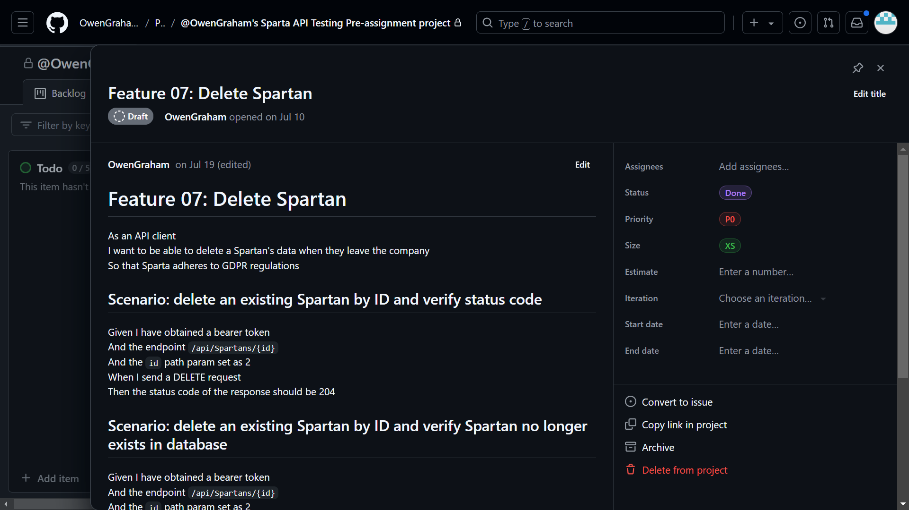
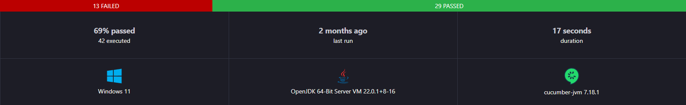

# Sparta API Testing Project

[GitHub](https://github.com/OwenGraham/Sparta-API-Testing)

## Overview

This is an API testing project created by Owen Graham for validating the functionality and reliability of the [Sparta Global Academy API](https://spartaacademyapi20240530152521.azurewebsites.net/swagger/index.html).

The test automation framework, built using RestAssured, is designed for comprehensive testing of the API's endpoints. It includes various testing strategies such as functional, integration, and contract testing to ensure robust validation of the API's responses. The framework is integrated with CI/CD pipelines and leverages Cucumber for BDD-style test scenarios, and JUnit and Mockito for unit testing.

This project showcases advanced API test automation skills and best practices in building scalable and maintainable test frameworks.

For further information, please contact the repository owner.

## Contents

- [API Documentation](#api-documentation)
- [User Guide](#user-guide)
- [Testing Strategy](#testing-strategy)
- [Framework Architecture](#framework-architecture)
- [Features, Scenarios, and Defects](#features-scenarios-and-defects)
- [CI/CD](#cicd-)
- [Contribution Guidelines For Future Testers](#contribution-guidelines-for-future-testers)

## API Documentation
[Here](https://spartaacademyapi20240530152521.azurewebsites.net/swagger/index.html)

## User Guide

### Prerequisites

- [Maven](https://maven.apache.org/download.cgi)
- [JDK 22](https://www.oracle.com/java/technologies/javase/jdk22-archive-downloads.html)
- [Docker](https://docs.docker.com/get-started/get-docker/)

The following setup instructions are for Windows operating systems.

### To run the containerized API

- Unzip `SpartaAcademyApp.zip`
- Open the **SpartaAcademyAPI** directory in a terminal
- Execute the following command to build the Docker image:
> `docker build -t spartaacedemyapi .`
- Start a Docker container from the built image using the following command:
> `docker run -d -p 8080:8080 -p 8081:8081 spartaacedemyapi`

Once finished, stop the container using the following command:

> `docker stop spartaacademyapi`

### To run the tests

1. Clone the repository to you local machine 
>`git clone https://github.com/OwenGraham/Sparta-API-Testing.git`
2. Open the repository in a terminal and build the project 
>`mvn clean install -DskipTests`
3. Run the following command to run all scenarios: 
>`mvn test -Dtest="com.github.owengraham.rest_assured_project.TestRunner"`
4. View the test results either in the terminal or by opening `cucumber-report/cucumber.html` in a browser.



### Running in suites

Tests are organised into suites using junit tag annotations, such as @Happy and @StatusCode. See the table below for all tags:

| Category                                                                                                                             | Tags                                                                                            |
|--------------------------------------------------------------------------------------------------------------------------------------|-------------------------------------------------------------------------------------------------|
| Feature                                                                                                                              | `@Feature1` `@Feature2` `@Feature3` `@Feature4` `@Feature5` `@Feature6` `@Feature7` `@Feature8` |
| HTTP method                                                                                                                          | `@Get` `@Post` `@Delete` `@Put`                                                                 |
| Happy or sad test case                                                                                                               | `@Happy` `@Sad`                                                                                 |
| Whether it is testing the status code, the message in the response body, or that the requested operation has been successful or not  | `@StatusCode` `@Message` `@Function`                                                            |

To run the tests in suites, use the groups system property of Maven's test command, and set the value as the name of the tag the scenarios you want to run are annotated with.

>`mvn test -Dgroups=Happy`

To run multiple suites, use a list of tags, separated by commas and enclosed in quotation marks.

>`mvn test -Dgroups="Post,StatusCode"`

Alternatively, in an IDE, tests can be run or not by adding/removing the relevant tags from the `@IncludeTags` annotation in the TestRunner class, or to run combinations of tags, add them to the Constants.FILTER_TAGS_PROPERTY_NAME configuration parameter.

For example, to run all tests annotated with **both** the `@Get` and `@Happy` tags, your TestRunner class should look like this 

```java
package com.sparta.ojg;

import io.cucumber.junit.platform.engine.Constants;
import org.junit.platform.suite.api.*;

@Suite
@IncludeTags({})
@SelectClasspathResource("features")
@ConfigurationParameter(key = Constants.GLUE_PROPERTY_NAME,value = "com.sparta.ojg.stepdefs")
@ConfigurationParameter(key = Constants.FILTER_TAGS_PROPERTY_NAME, value = "@Get and @Happy")
public class TestRunner {

}
```

## Running in an IDE

For best results, open the project in an IDE with the Cucumber plugin, and run the tests directly from the .feature files in src/test/resources/features.



## Testing Strategy

Before writing any test cases/user stories, a 1hr exploratory testing session of the endpoints was conducted using Postman and Swagger to quickly identify obvious defects and to familiarize myself with the Sparta API, the test charter can be found [here](https://github.com/users/OwenGraham/projects/3/views/1?pane=issue&itemId=70470391).

|  |  |
|--------------------------------------------------|--------------------------------------------------|

A [GitHub project board](https://github.com/users/OwenGraham/projects/3/views/1) was used to organise the project. 



This was divided into the following columns:

- ToDo: The project backlog
- In Progress: Items currently being worked on
- Done: Completed items
- Defects: defects identified during exploratory and automated testing
- Project DoD: The post requisites for the project to be considered completed.

An item was created for each feature to be tested, with these correlating to each endpoint of the API, and added to the ToDo column, and moved between columns appropriately. The tests for each feature were split into scenarios, written in Gherkin syntax.



The tests were written to assert correct functionality, response status codes, descriptive messages in response bodies, and input validation. Additionally, although the Swagger documentation suggests no authentication is required for any API calls, some tests were written to assert whether a valid bearer token is required for successful data read/writes. Each feature was given a priority value from P0 to P2 based on how critical the feature is, for instance get single Spartan was given a higher priority than get all Spartans, since so long as the former works correctly it can be used to substitute the latter. The priorities were also based on industry regulations, for example delete Spartan was given priority P0 since GDPR regulations stipulate that a person's data must be deleted when it is no longer needed. 

<br>The more specific test strategy for each feature is outlined below:

| Feature                     | Endpoint                     | HTTP Method | Description                                                                                                                                                                                                                                                                                                                                                                                                                                                                                                                                                                                                                                                                    |
|-----------------------------|------------------------------|-------------|--------------------------------------------------------------------------------------------------------------------------------------------------------------------------------------------------------------------------------------------------------------------------------------------------------------------------------------------------------------------------------------------------------------------------------------------------------------------------------------------------------------------------------------------------------------------------------------------------------------------------------------------------------------------------------|
| Obtain bearer token         | `/Auth/login`                | `POST`      | Verify that a token can be obtained from this endpoint when the request body contains a correctly formatted, valid username and password, but not if username or password are invalid.                                                                                                                                                                                                                                                                                                                                                                                                                                                                                         |
| View all courses            | `/api/courses`               | `GET`       | This endpoint does not take any parameters, so tests were just written to assert that the request is successful if a valid bearer token is provided in the request, and not otherwise.                                                                                                                                                                                                                                                                                                                                                                                                                                                                                         |
| View a specific course      | `/api/courses/{courseId}`    | `GET`       | - Check that data can't be accessed without providing a valid bearer token with the request.<br> - Check for appropriate response when requesting a non-existing course.<br> - Check for appropriate response when request contains invalid parameter. Only one test is written for this, where the `courseId`/`id` parameter is given as a string.                                                                                                                                                                                                                                                                                                                            |
| View a specific Spartan     | `/api/spartans/{spartanId}`  | `GET`       | Same as View a specific course                                                                                                                                                                                                                                                                                                                                                                                                                                                                                                                                                                                                                                                 |
| Create a new Spartan        | `/api/spartans`              | `POST`      | - Requests with valid Spartan data should be successful (200 status code response, informative message in response, Spartan data can be accessed in subsequent GET requests to Spartans endpoint).<br>- Requests with invalid Spartan data should be successful (400 status code response, informative message in response, Spartan data does not appear in subsequent GET requests to Spartans endpoint).<br>- The framework currently only has 3 test cases for invalid data, but more can easily be created by writing the invalid data as a JSON file, and adding to path to the file to the table's in `Test-Framework/src/test/resources/features/createSpartan.feature` |
| Update an existing Spartan  | `/api/spartans/{spartanId}`  | `PUT`       | The tests for this feature were similar to those for creating a new Spartan, with the addition of tests to ensure that a user cannot update an existing Spartan's ID to an ID that is already taken by another Spartan.                                                                                                                                                                                                                                                                                                                                                                                                                                                        |
| Delete an existing Spartan  | `/api/spartans/{spartanId}`  | `DELETE`    | - Verify delete Spartan correctly affects database and receives response with appropriate status code and informative error message.<br> - Verify attempts to delete non-existing Spartan don't affect database and receives response with appropriate status code and informative error message.                                                                                                                                                                                                                                                                                                                                                                              |

The full list of tests, with links to the respective items on the project board, is in the table below:

## Features, Scenarios, and Defects

| Feature                                                                                                              | Scenarios                                                                                                                     | Defects                                                                                                                                                                     |
|----------------------------------------------------------------------------------------------------------------------|-------------------------------------------------------------------------------------------------------------------------------|-----------------------------------------------------------------------------------------------------------------------------------------------------------------------------|
| [Feature 01: Obtain bearer token](https://github.com/users/OwenGraham/projects/3/views/1?pane=issue&itemId=70739945) | **Scenario 01.01** Request bearer token with correct username and password and verify status code of response                 | [**Defect 01.01.01** Incorrect status code for attempted login with invalid credentials](https://github.com/users/OwenGraham/projects/3/views/1?pane=issue&itemId=71538795) |
|                                                                                                                      | **Scenario 01.02** Request bearer token with correct username and password and verify response body contains token            |                                                                                                                                                                             |
|                                                                                                                      | **Scenario 01.03** Request bearer token with incorrect username and verify status code of response                            |                                                                                                                                                                             |
|                                                                                                                      | **Scenario 01.04** Scenario: Request bearer token with incorrect username and verify response body doesn't contain token      |                                                                                                                                                                             |
|                                                                                                                      | **Scenario 01.05** Request bearer token with incorrect password and verify status code of response                            |                                                                                                                                                                             |
|                                                                                                                      | **Scenario 01.06** Request bearer token with incorrect password and verify response body doesn't contain token                |                                                                                                                                                                             |
| [Feature 02: Get all courses](https://github.com/users/OwenGraham/projects/3/views/1?pane=issue&itemId=69844535)     | **Scenario 02.01** Get all courses with auth                                                                                  |                                                                                                                                                                             |
|                                                                                                                      | **Scenario 02.02** Get all courses without auth                                                                               | [**Defect 02.02.01** Get courses works without auth](https://github.com/users/OwenGraham/projects/3/views/1?pane=issue&itemId=70913493)                                     |
| [Feature 03: Get single course](https://github.com/users/OwenGraham/projects/3/views/1?pane=issue&itemId=69846640)   | **Scenario 03.01** Request an existing course by ID and verify status code of response                                        |                                                                                                                                                                             |
|                                                                                                                      | **Scenario 03.02** Request an existing course by ID and verify request body contains requested data                           |                                                                                                                                                                             |
|                                                                                                                      | **Scenario 03.03** Request a non-existing course by ID                                                                        | [**Defect 03.03.01** GET single course/Spartan incorrect status codes](https://github.com/users/OwenGraham/projects/3/views/1?pane=issue&itemId=70727771)                   | 
|                                                                                                                      | **Scenario 03.04** Request an existing course by ID without auth                                                              | [**Defect 03.04.01** Get single course works without auth](https://github.com/users/OwenGraham/projects/3/views/1?pane=issue&itemId=70928717)                               |
|                                                                                                                      | **Scenario 03.05** Request a course with invalid ID                                                                           |                                                                                                                                                                             |
| [Feature 04: Get all Spartans](https://github.com/users/OwenGraham/projects/3/views/1?pane=issue&itemId=69847293)    | **Scenario 04.01** Get all Spartans                                                                                           |                                                                                                                                                                             |
|                                                                                                                      | **Scenario 04.02** Get all Spartans without auth                                                                              |                                                                                                                                                                             |
| [Feature 05: Create Spartan](https://github.com/users/OwenGraham/projects/3/views/1?pane=issue&itemId=69848274)      | **Scenario 05.01** Create Spartan with valid data and verify status code                                                      |                                                                                                                                                                             |
|                                                                                                                      | **Scenario 05.02** Create Spartan with valid data and verify response body matches request data                               |                                                                                                                                                                             | 
|                                                                                                                      | **Scenario 05.03** Create Spartan with valid data and verify it appears in subsequent GET requests                            |                                                                                                                                                                             |
|                                                                                                                      | **Scenario 05.04** Create Spartan with invalid data and verify response status code                                           |                                                                                                                                                                             |
|                                                                                                                      | **Scenario 05.05** Create Spartan with invalid data and verify Spartan isn't added to database                                |                                                                                                                                                                             | 
|                                                                                                                      | **Scenario 05.06** Create Spartan with invalid data and check response for descriptive error message                          |                                                                                                                                                                             |
| [Feature 06: Get single Spartan](https://github.com/users/OwenGraham/projects/3/views/1?pane=issue&itemId=69847788)  | **Scenario 06.01** Request existing Spartan by ID and verify status code of response                                          |                                                                                                                                                                             |
|                                                                                                                      | **Scenario 06.02** Request existing Spartan by ID and verify response body contains requested data                            |                                                                                                                                                                             |
|                                                                                                                      | **Scenario 06.03** Request a non-existing Spartan by ID                                                                       | [**Defect 06.03.01**  Get non-existent spartan gives wrong status code](https://github.com/users/OwenGraham/projects/3/views/1?pane=issue&itemId=71546886)                  |
|                                                                                                                      | **Scenario 06.04** Request Spartan with invalid ID                                                                            |                                                                                                                                                                             |
| [Feature 07: Delete Spartan](https://github.com/users/OwenGraham/projects/3/views/1?pane=issue&itemId=70436057)      | **Scenario 07.01** Delete an existing Spartan by ID and verify status code                                                    | [**Defect 07.01.01**: DELETE Spartan response doesn't provide any information](https://github.com/users/OwenGraham/projects/3/views/1?pane=issue&itemId=70728831)           | 
|                                                                                                                      | **Scenario 07.02** Delete an existing Spartan by ID and verify Spartan no longer exists in database                           |                                                                                                                                                                             |   
|                                                                                                                      | **Scenario 07.03** Delete a non-existing Spartan                                                                              |                                                                                                                                                                             |
| [Feature 08: Update Spartan](https://github.com/users/OwenGraham/projects/3/views/1?pane=issue&itemId=70439384)      | **Scenario 08.01** Update existing Spartan with valid data and verify status code of response                                 | [**Defect 08.01.01** Incorrect status code for successful update spartan](https://github.com/users/OwenGraham/projects/3/views/1?pane=issue&itemId=71392292)                |
|                                                                                                                      | **Scenario 08.02** Update existing Spartan with valid data and verify database is updated correctly                           |                                                                                                                                                                             |
|                                                                                                                      | **Scenario 08.03** Update existing Spartan with invalid (missing/incorrect data type) data and verify status code of response | [**Defect 08.03.01** Update Spartan operation works when data is missing](https://github.com/users/OwenGraham/projects/3/views/1?pane=issue&itemId=71394609)                | 
|                                                                                                                      | **Scenario 08.04** Update existing Spartan with invalid (missing/incorrect data type) data and verify database isn't updated  |                                                                                                                                                                             | 
|                                                                                                                      | **Scenario 08.05** Update non-existing Spartan                                                                                | [**Defect 08.05.01** Update non-existing Spartan returns incorrect response code](https://github.com/users/OwenGraham/projects/3/views/1?pane=issue&itemId=71396210)        |
|                                                                                                                      | **Scenario 08.06** Update existing Spartan's ID to already taken ID                                                           |                                                                                                                                                                             |

## Framework Architecture


The framework is build using JUnit and Cucumber, with features split into scenarios written declaratively in Gherkin syntax, which can be found [here](Test-Framework/src/test/resources/features).
Each step in the scenarios is tied to a method in one of the [StepDef classes](Test-Framework/src/test/java/com/sparta/ojg/stepdefs) by the TestRunner class. StepDefs that are used in multiple different scenarios are in `CommonStepDefs.java`, and functionality that is used by multiple different stepdefs are encapsulated into methods in [Utils.java](Test-Framework/src/test/java/com/sparta/ojg/Utils.java).
Data is shared between the StepDef classes using a Cucumber Pico Container, [SharedState.java](Test-Framework/src/test/java/com/sparta/ojg/SharedState.java).
The functionality of all StepDefs were tested independently of their dependencies using Mockito. These tests can be found/ran in `Test-Framework/src/test/java/com/sparta/ojg/stepDefTests`. 
The data used in the tests is all written in JSON files found [here](Test-Framework/src/test/resources/Test Data).

## CI/CD 

A GitHub action workflow was created and can be found [here](.github/workflows/test.yml). This runs on pushes and pull requests to `main`, and builds the maven project, and runs the tests, so that the pull request is only successful if all tests pass.

The framework is set to run using the Docker image unless it is running on a Linux OS. This is so that the tests run against the live API during GitHub action workflow runs. The code responsible for this is in `Test-Framework/src/test/java/com/sparta/ojg/SharedState.java`.

## Test Metrics



## Contribution Guidelines For Future Testers

Future testers should consider: 

- Adding more test cases to check correct data validation for path parameters and request bodies for POST and PUT requests. This can easily be achieved by adding them to the data tables in the .feature files.
- The product owner should be contacted to discuss the status codes provided by the API, as in many cases the codes received and the most suitable. Similarly, they may want to consider adding more informative messages to API responses.
- The create Spartan feature needs fixing.
- The Swagger documentation should be updated to correctly provide level of authentication needed for API calls.
- Create POJO objects for Spartans and courses for more thorough comparison of expected and actual data. 
